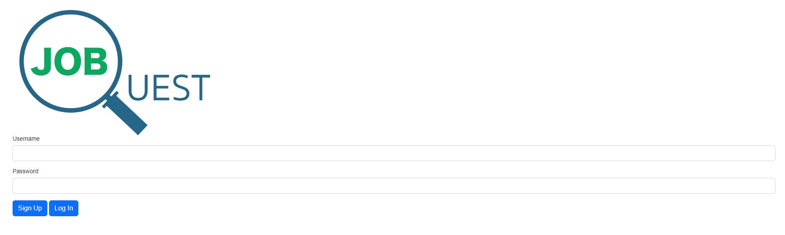
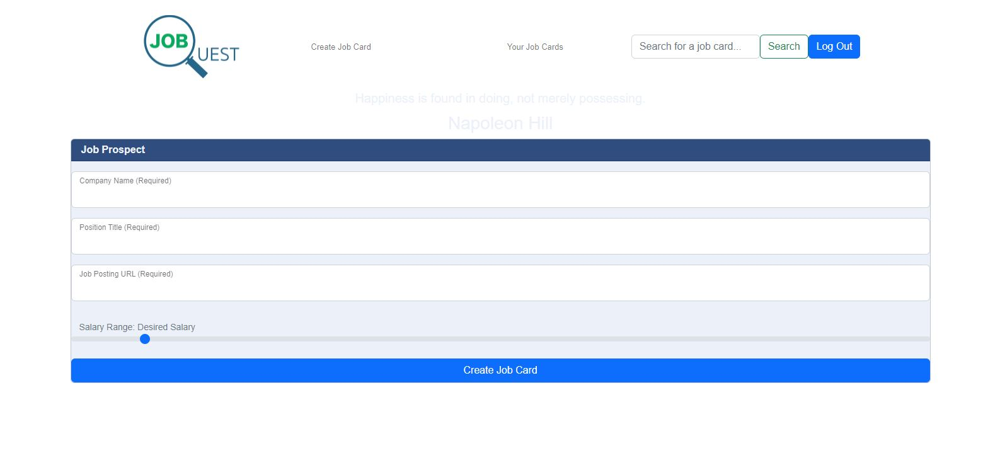
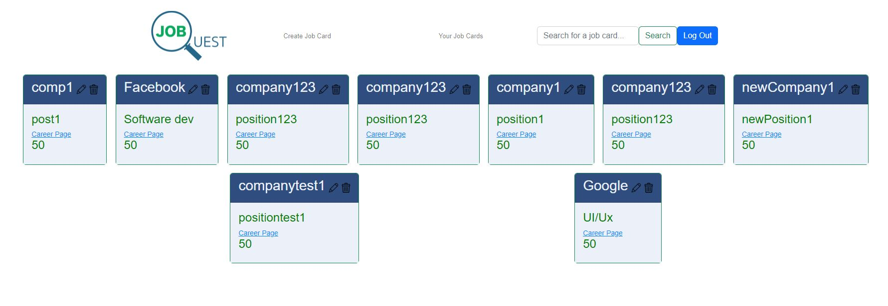

# Job Quest
​
## Table of contents
​
- [Overview](#overview)
  - [The challenge](#the-challenge)
  - [User Story](#user-story)
  - [Acceptance Criteria](#acceptance-criteria)
  - [Screenshot](#screenshot)
  - [Links](#links)
- [My process](#my-process)
  - [Built with](#built-with)
  - [What I learned](#what-i-learned)
  - [Continued development](#continued-development)
- [Author](#author)
- [Acknowledgments](#acknowledgments)
​​
## Overview

This application was created to aid our job searching process once we have completed our coding bootcamp program. We wanted to created an app to help keep track of all the jobs that we have applied to, to ensure we have all the accurate information for each job as well as ensuring that we can follow up with updates on the interviewing process and hiring process.
​
### The challenge
​
This is a collaborative project to create a real world full stack application by showcasing skills we have acquired so far in our coding bootcamp. This project aims to provide people with practical application using Node.js and Express.js to create a RESTful API. This application also requires the usage of Handlebars.js, MySQL, Sequelize ORM, and an authentication middleware.
​
### User Story
​
```
AS AN unemployed bootcamp student
I WANT to be able to log all the jobs that I am interested in and have applied to
SO THAT I can easily track all my jobs and stay organized during my job seach process
```

### Acceptance Criteria
​
```
GIVEN a user friendly web application
WHEN I input my username and password
THEN I sign up and log in to my account
WHEN I input information about a job
THEN I save the information in a data base for future reference
WHEN I choose to view the job's information
THEN I am presented with all the information
WHEN I log out of the session
THEN I end my session and redirected to the login page
```
​
### Screenshot
​



​
### Links
​
- Live deployment[Heroku-page](https://jobquest.herokuapp.com/)
- Github repository [Github](https://github.com/AllSystemsRGeorge/Job-Quest.git)
​
## My process
​
### Built with
​
- Node.js
- Express.js
- Passport.js
- Sessions
- Sequelize
- Handlebars
- .env
- cors
- Heroku
- Javascript

### What we learned
​
This project was a great opportunity to showcase the skills we have learned in the bootcamp. In addition to setting a stronger coding foundation, we learned the intricacies of creating an application with the front end and back end. With the back end, we were able to set up a server and create a database. We used handlebars for the front end of our application. 

In addition to the skills to code the application, we learned how to work in a team. Each of our team members had different backgrounds, so learning how to showcase each of our strengths was proven to be efficacious. We also learned that communication was key to the development of our app. 

### Continued development
​
Although we are proud of what we have made, there are still more room for improvement:

-further improve the user authentication
-add some a reward system for when users create/applied to a certain number of jobs to make it more fun and motivating for users
-adding a user profile page so that users are able to make the app more customizable (profile pic etc.)
-add a functionality where user is able to compare Card A with Card B with Card C etc, so they can compare the different job offers side by side


## Authors
​
- Portfolio
  - [Moussa Dia](https://theanswer07.github.io/Portfolio-MD/) 
  - [George Durando](https://allsystemsrgeorge.github.io/PortfolioProfile/)
  - [Lillian Kim](https://liliankim.github.io/homework-2/)
  - [Adriane Ocampo](https://ocampoad.github.io/Adriane_Ocampo_Portfolio/)
  - [Monineath Sar](https://monineathsar.github.io/My_Portfolio-Challenge2/)

- Github
  - [Moussa Dia](https://github.com/TheAnswer07) 
  - [George Durando](https://github.com/AllSystemsRGeorge)
  - [Lillian Kim](https://github.com/liliankim)
  - [Adriane Ocampo](https://github.com/ocampoad)
  - [Monineath Sar](https://github.com/monineathsar)
  
## Acknowledgments
​ 
We appreciate all the time, help and support the TA provided us. We would like to give a shout out to Luigi, Scott, Paul and all the TA's. 